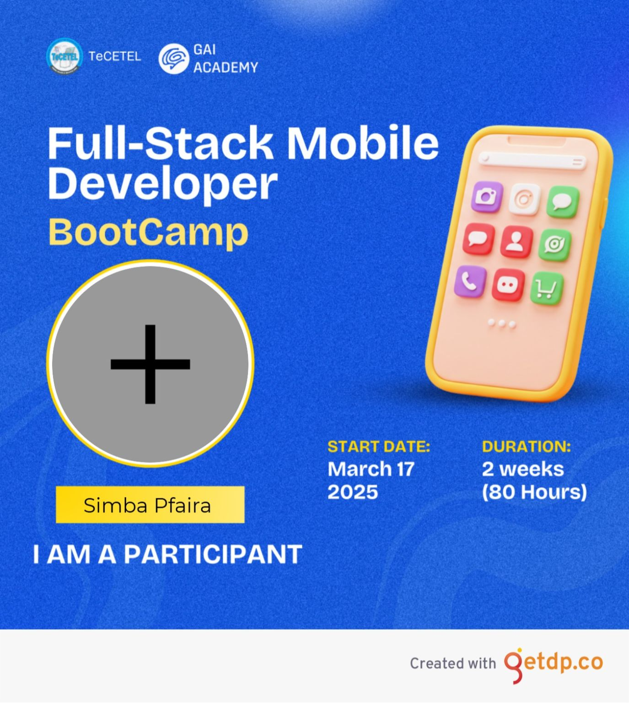

# Ionic Repository

## GAIA x TeCETEL Fullstack Mobile Developer Bootcamp

### Assignment 1

> A simple Ionic React app that displays a "Welcome to Bootcamp" message with a header and a footer.

### Assignment 2

> An Ionic app with two tabs, home tab displaying a welcome message and form tab to collect user information

### Assignment 3

> An Ionic app that fetches posts from JSON Placeholder API and uses context to manage user information state.

### Assignment 4

> An Ionic app that uses Virtuoso to render long lists, React Hook Form & Zod for form validation and Capacitor for using Native APIs like Camera.

### Assignment 5

> A basic Node.js + Express.js server that connects to a MongoDB database and implements CRUD operations for student schema.
